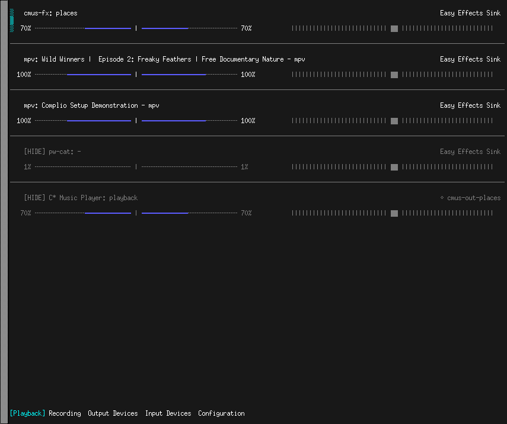
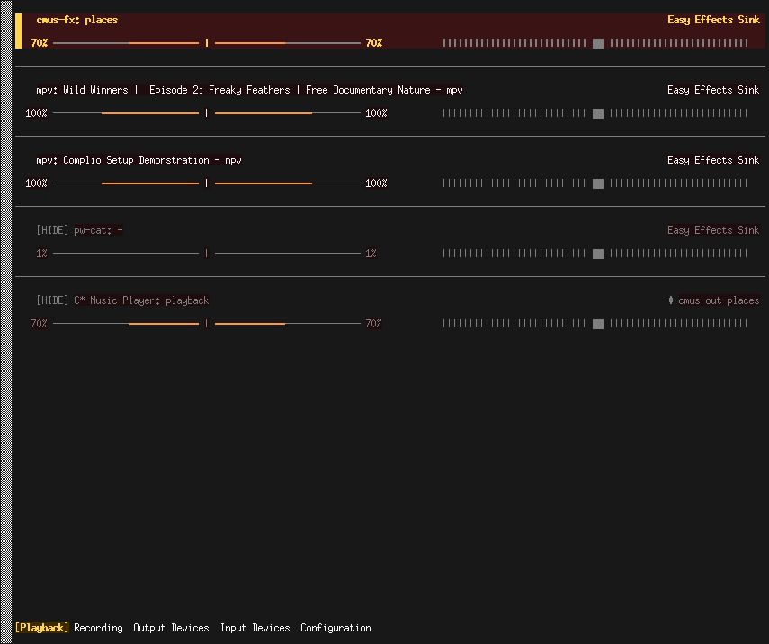

# wiremix-extras

This repository is an experiment: it takes [tsowell/wiremix](https://github.com/tsowell/wiremix)
and combines a set of independent feature branches from
[HoneyHazard/wiremix](https://github.com/HoneyHazard/wiremix) — each already
proposed upstream as its own focused pull request — into one build, so the
combination can be evaluated as a whole rather than one change at a time.
It exists purely as a convenience for trying things out; it isn't a
statement that any of this belongs upstream, and every feature here remains
available as its own small, independently-reviewable PR against the
original project. Feedback on either the individual PRs or the combined
experience here is very welcome.

## What's included

- **Item dividers** — an optional line drawn between list items, for
  visually busy tabs.
- **Compact layout** — an optional shorter per-item layout that fits more
  on screen at once.
- **Peak-monitoring reliability and efficiency** — evicted capture streams
  are disconnected before being dropped (avoiding a leak under frequent
  capture rotation), capture streams opt out of WirePlumber's state
  persistence, and the number of simultaneously-open capture streams can be
  capped and rotated, both per instance and (best-effort) across every
  running instance at once.
- **Lenient config parsing** — an option to ignore unknown configuration
  fields (with a warning) instead of failing to start, for config files
  shared across versions.
- **F1–F5 tab shortcuts** — default keybindings to jump straight to a tab
  by position.
- **PageUp/PageDown/Home/End navigation**.
- **Hide/show for list items** — per-instance (`t`) and permanent,
  cross-instance-synced (`Ctrl+t`) hiding, with an option to exclude hidden
  items from peak monitoring on top of any other capture limits.
- **Selected-row text theming** — `row_selected`/`row_unselected` theme
  keys for customizing how the current row's text (not just its
  background) is highlighted.
- **A built-in dark theme** (`-t redshift -s redshift_compact`) — ready to
  try with no configuration file needed.
- **Multichannel and channel-pairing support** — per-channel volume
  control, an optional split display for a node's individual channels
  (radiating from a shared center marker for a detected stereo pair, or
  stacked one row per channel/group), a dedicated Channel mode for
  addressing one channel at a time, and configurable per-view layout. This
  is by far the largest change here — see its own section below.

| Default theme | Built-in dark theme (`-t redshift -s redshift_compact`) |
| --- | --- |
|  |  |

Both show item dividers and split (radiating) volume/meter display for
detected stereo pairs; the dark theme screenshot also shows the selected
row's distinct text/background styling.

## Merge sequence

`main` is built by merging each feature branch into classic wiremix's own
`main`, in this order — real merges, each keeping its own commit history,
not squashes. Every step before the last has an open pull request against
`tsowell/wiremix`; reproducing this build from scratch means merging them
in the same order.

1. [item-dividers](https://github.com/tsowell/wiremix/pull/68)
2. compact-layout (extends item-dividers; no upstream PR yet)
3. [fix-capture-stream-disconnect-leak](https://github.com/tsowell/wiremix/pull/69)
4. [metering-skip-state-persistence](https://github.com/tsowell/wiremix/pull/64)
5. [lenient-config](https://github.com/tsowell/wiremix/pull/73)
6. [fkey-tab-shortcuts](https://github.com/tsowell/wiremix/pull/67)
7. [pgup-pgdown-navigation](https://github.com/tsowell/wiremix/pull/65)
8. [max-concurrent-captures](https://github.com/tsowell/wiremix/pull/66) /
   [max-concurrent-captures-global](https://github.com/tsowell/wiremix/pull/70)
9. [hide-items-instance](https://github.com/tsowell/wiremix/pull/71) /
   [hide-items-permanent](https://github.com/tsowell/wiremix/pull/72)
10. [theme-row-selected-text](https://github.com/tsowell/wiremix/pull/63)
11. dark-theme (a maintained branch in `HoneyHazard/wiremix`; no upstream
    PR — it's a personal theme, not a proposed default)
12. [multichannel-pairing](https://github.com/HoneyHazard/wiremix/tree/multichannel-pairing)
    — merged last, as it's both the largest change and the one most likely
    to keep evolving. A draft pull request against `tsowell/wiremix` is
    planned; until then this links directly to the branch.

---

# wiremix

wiremix is a simple TUI audio mixer for PipeWire. You can use it to adjust
volumes, route audio between devices and applications, and configure audio
device settings like input/output ports and profiles.

wiremix's interface is more or less a clone of the wonderful
[ncpamixer](https://github.com/fulhax/ncpamixer) which was itself inspired by
pavucontrol, so users of either should find it familiar.

Issues and pull requests are welcome!


## Installation

### Package Managers

[](https://repology.org/project/wiremix/versions)

### Manual Installation

wiremix depends on Rust and the PipeWire libraries. To install all
dependencies:

* Ubuntu: `sudo apt install cargo libpipewire-0.3-dev pkg-config clang`
* Debian: `sudo apt install libpipewire-0.3-dev pkg-config clang` (you will
  also need to install a somewhat recent Rust toolchain - rustup is one way)

Then install wiremix with `cargo install wiremix`

## Quick Start

1. Run `wiremix` to launch with default settings
2. Use mouse and keyboard bindings to operate the mixer
   - ? to display keyboard bindings
   - Arrow keys or hjkl to navigate and adjust volume
   - Tab or HL to change tabs
   - c to open a dropdown to route audio to a different destination
   - m to mute/unmute
   - d set an input or output device as the default source/sink

## Command-line Options

```
PipeWire mixer

Usage: wiremix [OPTIONS]

Options:
  -c, --config <FILE>
          Override default config file path
  -r, --remote <NAME>
          The name of the remote to connect to
  -f, --fps <FPS>
          Target frames per second (or 0 for unlimited)
  -s, --char-set <NAME>
          Character set to use [built-in sets: default, compat, extracompat]
  -t, --theme <NAME>
          Theme to use [built-in themes: default, nocolor, plain]
  -p, --peaks <PEAKS>
          Audio peak meters [possible values: off, mono, auto]
      --no-mouse
          Disable mouse support
      --mouse
          Enable mouse support
  -v, --tab <TAB>
          Initial tab view [possible values: playback, recording, output, input,
          configuration]
  -T, --tabs <TABS>...
          Which tabs are present and their order [possible values: playback,
          recording, output, input, configuration]
  -m, --max-volume-percent <PERCENT>
          Maximum volume for volume sliders
      --no-enforce-max-volume
          Allow increasing volume past max-volume-percent
      --enforce-max-volume
          Prevent increasing volume past max-volume-percent
      --no-lazy-capture
          Monitor peak levels of all nodes
      --lazy-capture
          Only monitor peak levels of on-screen nodes (reduces CPU usage, but
          peaks appear with a slight delay)
  -h, --help
          Print help
  -V, --version
          Print version
```

Command-line options override corresponding settings in the configuration file.

## Input Bindings

Everything except quitting can also be done with the mouse. Some of the
less-intuitive mouse controls are:

* Click the numeric volume percentage to toggle muting.
* Scroll through lists and dropdowns with the mouse wheel or click on scroll
  buttons (default appearance: `•••`)
* Right-click to set as the default source/sink

### Default Keyboard Bindings

| Input         | Action                  |
| ------------- | ----------------------- |
| q             | Quit                    |
| m             | Toggle mute             |
| t             | Hide/show (this instance only) |
| Ctrl+t        | Hide/show (permanent, synced)  |
| d             | Set default source/sink |
| l/Right arrow | Increment volume        |
| h/Left arrow  | Decrement volume        |
| Enter/c       | Open dropdown or choose |
| Esc           | Cancel dropdown         |
| j/Down arrow  | Move down               |
| k/Up arrow    | Move up                 |
| PageDown      | Move down a page        |
| PageUp        | Move up a page          |
| End           | Move to last item       |
| Home          | Move to first item      |
| H/Shift+Tab   | Select previous tab     |
| L/Tab         | Select next tab         |
| F1-F5         | Select tab by position  |
| ` (Backtick)  | Set volume 0%           |
| 1             | Set volume 10%          |
| 2             | Set volume 20%          |
| 3             | Set volume 30%          |
| 4             | Set volume 40%          |
| 5             | Set volume 50%          |
| 6             | Set volume 60%          |
| 7             | Set volume 70%          |
| 8             | Set volume 80%          |
| 9             | Set volume 90%          |
| 0             | Set volume 100%         |
| ?             | Toggle help screen      |

## Configuration

wiremix can be configured through a TOML configuration file.

It searches for the configuration file in these locations (in order of
precedence):

1. Path specified on the command-line via `-c`/`--config`
2. `$XDG_CONFIG_HOME/wiremix/wiremix.toml`
3. `~/.config/wiremix/wiremix.toml`

This README only describes basic capabilities. Please see
[wiremix.toml](./wiremix.toml) in this repository for detailed documentation on
configuring wiremix. It also provides a reference for all of wiremix's
defaults.

The configuration specified in the file is merged with wiremix's defaults, so
it only needs to specify the options that need to be changed. It is recommended
to start with an empty configuration file and use this repository's
[wiremix.toml](./wiremix.toml) as a reference.

### Basic Configuration

Everything that can specified on the command-line has a corresponding option in
the configuration file.

```toml
#remote = "pipewire-0"
#fps = 60.0
mouse = true
peaks = "auto"
char_set = "default"
theme = "default"
tab = "playback"
tabs = [ "playback", "recording", "output", "input", "configuration" ]
max_volume_percent = 150.0
enforce_max_volume = false
lazy_capture = false
```

### Keybindings

The configuration file can customize keyboard controls for all wiremix actions.
See [wiremix.toml](./wiremix.toml) for more details.

#### Examples

```toml
keybindings = [
 # Use ncpamixer-style absolute volume bindings
 { key = { Char = "`" }, action = "Nothing" },
 { key = { Char = "0" }, action = { SetAbsoluteVolume = 0.0 } },
 # Chars 1-9 already work like ncpamixer
]
```

F1-F5 already select a tab by position by default. To remap that to
different keys instead (e.g. if F-keys are intercepted by your terminal or
window manager):

```toml
keybindings = [
 # Free up F1-F5 and use Alt+1 through Alt+5 for tab selection instead
 { key = { F = 1 }, action = "Nothing" },
 { key = { F = 2 }, action = "Nothing" },
 { key = { F = 3 }, action = "Nothing" },
 { key = { F = 4 }, action = "Nothing" },
 { key = { F = 5 }, action = "Nothing" },
 { key = { Char = "1" }, modifiers = "ALT", action = { SelectTab = 0 } },
 { key = { Char = "2" }, modifiers = "ALT", action = { SelectTab = 1 } },
 { key = { Char = "3" }, modifiers = "ALT", action = { SelectTab = 2 } },
 { key = { Char = "4" }, modifiers = "ALT", action = { SelectTab = 3 } },
 { key = { Char = "5" }, modifiers = "ALT", action = { SelectTab = 4 } },
]
```

### Character Sets

Character sets define the symbols used in the user interface. You can define
multiple character sets and switch between them using the `char_set`
configuration option or the `-s`/`--char-set` command-line argument.

There are three built-in character sets.

1. `default` is the default set. It may contain symbols that can't be rendered
   with your terminal or console.
2. `compat` uses only symbols from
   [cross-platform-terminal-characters](https://github.com/ehmicky/cross-platform-terminal-characters).
3. `extracompat` uses only ASCII symbols.

The configuration file allows for both modifying built-in character sets and
creating custom ones.

See [wiremix.toml](./wiremix.toml) for more details.

### Themes

Themes define colors and other text attributes for UI elements. They are
similar to character sets in that you can define your own themes and switch
between them with the `theme` configuration option or the `-t`/`--theme`
command-line arguments.

There are three built-in themes:

1. `default` is the default theme.
2. `nocolor` uses no color, only attributes.
3. `plain` uses only the default style - no colors or attributes.

The configuration file allows for both modifying built-in themes and creating
custom ones.

See [wiremix.toml](./wiremix.toml) for more details.

### Filters

You can filter objects to exclude them from object lists based on their
PipeWire properties.

See [wiremix.toml](./wiremix.toml) for more details.

#### Examples

```toml
[[filters]]
# Hide virtual endpoints
matches = [ { "node.virtual" = "true", "media.class" = "Audio/Sink" } ]
```

### Names

You can customize how streams, endpoints, and devices are displayed in the user
interface using a template system to generate names from PipeWire properties.

It's likely that any particular naming scheme won't work well with 100% of your
software and devices, so you can also specify alternate name templates to use
for PipeWire nodes matching configurable criteria.

See [wiremix.toml](./wiremix.toml) for more details.

#### Examples

The default naming scheme is:

```toml
[names]
stream = [ "{node:node.name}: {node:media.name}" ]
endpoint = [ "{device:device.nick}", "{node:node.description}" ]
device = [ "{device:device.nick}", "{device:device.description}" ]
```

Not all nodes and devices have the same properties present, so if multiple
naming templates are specified, wiremix will try to resolve them in order and
use the first one that works.

For ncpamixer-style names you can use:

```toml
[names]
stream = [ "{node:node.name}: {node:media.name}" ]
endpoint = [ "{node:node.description}" ]
device = [ "{device:device.description}" ]
```

I use these overrides with the default names:

```toml
# This device's device.name is truncated to "USB-C to 3.5mm Headphone Jack
# A". This override makes wiremix use device.description instead, which for
# this device is "USB-C to 3.5mm Headphone Jack Adapter".
[[names.overrides]]
types = [ "endpoint", "device" ]
matches = [ { "device:device.name" = "alsa_card.usb-Apple__Inc._USB-C_to_3.5mm_Headphone_Jack_Adapter_DWH841302FEJKLTA3-00" } ]
templates = [ "{device:device.description}" ]

# The Spotify client's node.name is "spotify", and it also uses "Spotify" for
# media.name. This override makes wiremix use just the node.name, so it shows
# as "spotify" instead of "spotify: Spotify".
[[names.overrides]]
types = [ "stream" ]
matches = [ { "node.name" = "spotify" } ]
templates = [ "{node:node.name}" ]

# mpv is also a bit redundant with the default naming scheme - it suffixes
# media.name with "- mpv". This override makes it show as "foo - mpv" instead
# of "mpv: foo - mpv".
[[names.overrides]]
types = [ "stream" ]
matches = [ { "node.name" = "mpv" } ]
templates = [ "{node:media.name}" ]
```
